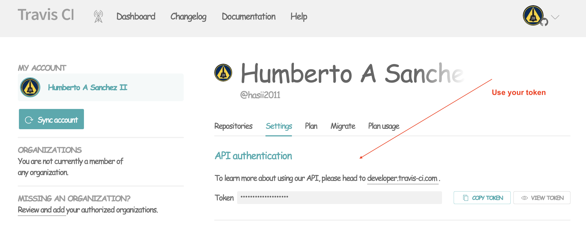

[](https://opensource.org/licenses/MIT)
[](https://badge.fury.io/py/traviscli)
[](https://GitHub.com/Naereen/StrapDown.js/graphs/commit-activity)
[](https://svgshare.com/i/ZjP.svg)

[](https://www.python.org/)

## Introduction
This is a simple CLI that allows you to update a version.txt file with a build number.
    
## Install traviscli in your virtual environment
This utility is distributed via [pypi](https://pypi.org/project/traviscli/) packages.

Install like this:
```commandline
pip3 install traviscli
```

## How to use

```commandline
traviscli --help
Usage: traviscli [OPTIONS]

  Use this command to get the Travis CI build number of your project.  Assumes
  you are using Semantic Versioning

Options:
  -b, --build-count INTEGER  Number builds to check.
  -r, --repo-slug TEXT       something thing like hasii2011/PyUt.  [required]
  -f, --file PATH            Relative location of version text file
  --major-version INTEGER    Change the major number to the specified one
  --minor-version INTEGER    Change the minor number to the specified one
  --patch-version INTEGER    Change the patch number to the specified one
  --version                  Show the version and exit.
  --help                     Show this message and exit.
```
## How to get your TravisCI Application Token
Go to your `TravisCI Profile-->Settings-->Settings` Tab

For example:



## Where to put configuration token 
Create a file named `.travis-cli.ini` in your home directory (or where `$HOME` points to)

## Configuration file format
```ini
[TRAVISCI]
travisci_api_token = Your Token goes here
```
## Version file format

The version string in your version file should follow the rules for [semantic versioning](https://semver.org)

For example, here is a correctly formatted version string

`6.2.1+.500`


